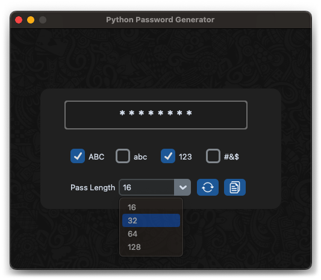

# PassGen
Password Generator GUI made with Python. This is a small project that demonstrates designing a GUI using Tkinter & CustomTkinter.  Other tech used: Pillow for setting up the background wallpaper and PyperClip to copy the generated password to the system clipboard.

# Tech
- Python
- Tkinter
- CustomTkinter
- Pillow
- PyperClip

# Screenshot

